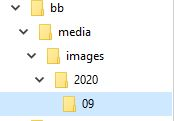

# Python Automation: Automatic Desktop Cleanup 
This project will organize your desktop files (any path in your system) by its type, date, and name. The code starts to observe the specified path in your system. Whenever the user makes a change in that path, the code checks the changes and moves the added file to another directory, and you get desktop notification for it.

The code consists of two main paths, 'Watch Path' and 'Destination Path.' These two paths can be anywhere in your system or in your server. The code observes the 'Watch Path' folder and moves the files to the 'Destination Path.' All the files that are moved to the 'Destination Path' will be in a specific folder based on their types, like doc, media, and etc.

Furthermore, another feature of this project is that the code checks the file, and if it exists in the 'Destination Path,' the code renames the file and then moves it. This feature prevents the overwriting.


 
## Install

### Dependencies

You need dependencies below.

- python3
- watchdog
- win10toast
- pathlib
- shutil


### Install the repo and the requirements

Clone the repo and install 3rd-party libraries.

```bash
$ git clone 
$ cd Desktop Cleaner
$ pip3 install -r requirements.txt
```

 
## Run the code

You can run the the code with this:

```
python3 Desktop_Cleaner.py
```
After you run the code, the code starts observing the path and each time something changes you will see a desktop notification on your screen which is something like this:


And when you add a file to your "Watch Path":


The 'Destination Path' will be something like this:

 

 



## CODE

Importing libraries 
 
 ```
from time import sleep
from watchdog.observers import Observer
import shutil
from datetime import date
from pathlib import Path
from watchdog.events import FileSystemEventHandler
from ext import extension_paths
from win10toast import ToastNotifier 
 ```
 
 Desktop notification object
 
 ```
toaster = ToastNotifier() 
 ```

### "Rename file" Function
"Rename file" function renames file to reflect new path. If a file of the same name already exists in the destination folder, the file name is numbered and incremented until the filename is unique (prevents overwriting files).

```
def rename_file(source: Path, destination_path: Path):
    if Path(destination_path / source.name).exists():
        increment = 0

        while True:
            increment += 1
            new_name = destination_path / f'{source.stem}_{increment}{source.suffix}'

            if not new_name.exists():
                return new_name
    else:
        return destination_path / source.name

```


### "Add date to path" Function
this function adds current year/month to destination path. If the path doesn't already exist, it is created.

```
def add_date_to_path(path: Path):
    dated_path = path / f'{date.today().year}' / f'{date.today().month:02d}'
    dated_path.mkdir(parents=True, exist_ok=True)
    return dated_path

```


### "Extension"
This file is a switch case like function that determines the destination folder in the 'Destination Path':

```
extension_paths = {
        # audio
        '.aif':    'media/audio',
        '.cda':    'media/audio',
        '.mid':    'media/audio',
        '.midi':   'media/audio',
        '.mp3':    'media/audio',
        # text
        '.txt':    'text/text_files',
        '.doc':    'text/microsoft/word',
        '.pdf':    'text/pdf',
        # video
        '.m4v':    'media/video',
        '.mkv':    'media/video',
        '.mov':    'media/video',
        '.mp4':    'media/video',
        '.mpg':    'media/video',
        # images
        '.gif':    'media/images',
        '.JPG':    'media/images',
        '.jpeg':   'media/images',

....

```


 
 
 # Future 
 You can modify this project to obseve any folder anywhere in your system. Also,  if you implement this project in your work place, you can get a notification via any social media to get an update regarding any change in your files.
